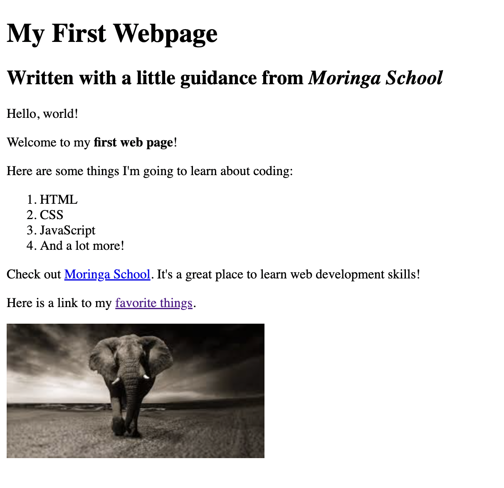

# Lolo's First Website

#### Shows my first website with favourite things link ,08-09-2022
#### By **Lawrence Karani**
[](https://www.linkedin.com/in/lawrencekarani/)
## Description
This shows the languages I will learn as well as a link with my favourite things
## Setup/Installation Requirements
* Navigate to the github repository [(here)](https://github.com/Zelawlaw/my-first-website)
* Clone the repository
  ```sh
    git clone git@github.com:Zelawlaw/my-first-website.git
   ```
* Navigate to the directory my-first-website
  ```sh
    cd my-first-website
   ```
* view `my-first-webpage.html` using a web browser like chrome

## Future Improvements
Development of a landing page at `index.html`
## Technologies Used
HTML was used for this website
## Support and contact details
To contribute to this project , please create a pull request.
### License
*MIT License*
Copyright (c) 2022 **[(lawrence Karani)](https://www.linkedin.com/in/lawrencekarani/)**